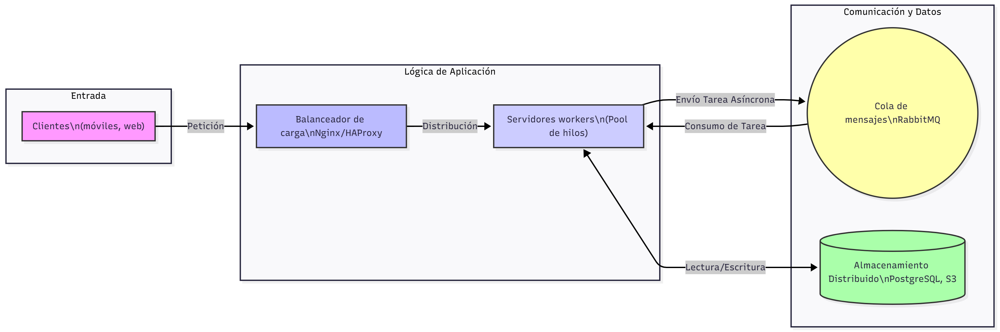

# PFO 3: Sistema Distribuido de Gestión de Tareas (Sockets, Workers y Cola)

## Instrucciones para Ejecutar el Proyecto
Este proyecto implementa una API REST básica para la gestión de usuarios (registro e inicio de sesión) utilizando Flask y SQLite. Las contraseñas se almacenan de forma segura mediante *hashing* con Werkzeug.

### Requisitos
* Python 3.x

### Archivos del Proyecto

servidor.py
cliente.py

---
### Ejecución del Sistema 
Para simular la arquitectura completa (Cliente-Servidor), se debe ejecutar el Servidor en una terminal y el Cliente en otra.

### Paso A: Iniciar el Servidor Distribuidor y Workers

El servidor se encarga de escuchar conexiones en el puerto 65432, inicializar la cola de tareas y lanzar el pool de Workers (hilos de procesamiento).

Abre la Terminal 1.

Ejecuta el servidor:

python servidor_distribuidor.py

Resultado Esperado: Verás mensajes de inicialización indicando que la Cola de Tareas y el Pool de Workers (con 5 hilos) están listos.

### Paso B: Iniciar el Cliente y Enviar Tareas

El cliente se conecta al servidor, envía una tarea en formato JSON por socket y espera la respuesta.

Abre la Terminal 2.

Ejecuta el cliente:

python cliente.py

### Diagrama

